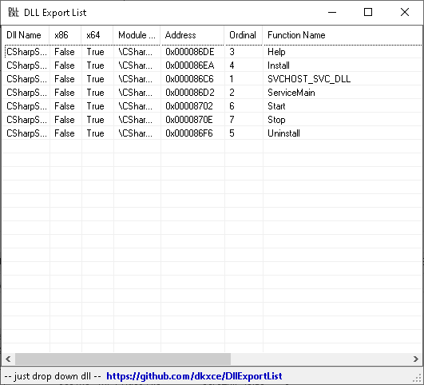
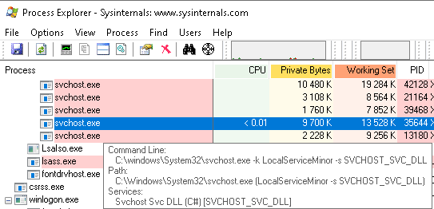

# SVCHOST SERVICEDLL TEMPLATE

[Windows](https://en.wikipedia.org/wiki/Microsoft_Windows) [svchost.exe](https://en.wikipedia.org/wiki/Svchost.exe) [service](https://en.wikipedia.org/wiki/Windows_service) [dll](https://en.wikipedia.org/wiki/Dynamic-link_library) template (C++ or C#).     
Allow to run and control your own service with svchost.exe   

       
    

! Do not forget to add [nuget package](https://www.nuget.org/packages/DllExport/) [DllExport](https://github.com/3F/DllExport) !